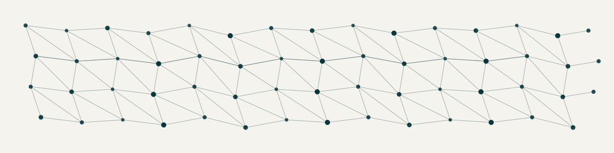

  

<h1 align="center">Hi there 👋 I'm Yaasameen</h1>

  <i>Sales pro turned software engineer — I spent years closing deals and building relationships, now I'm building products.</i>

---

### 🛠️ Tech Stack

  
  
  
  
  
  
  
  
  
  
  
  

---

### A bit about me

As an **AI-Native Software Engineering Fellow at Pursuit**, I've gone from prospecting clients to shipping full-stack AI products — including a VC relationship intelligence platform for AlleyCorp.

I love the intersection of **people and products**. Whether that's in tech sales, sales development, or product engineering — I'm drawn to roles where understanding users is just as important as building for them.

Before code, I was closing deals in healthcare and hospitality, and I founded a self-defense business from the ground up. These days, I bring that same consultative mindset to building software.

Let's connect if you're working on something at the intersection of **AI, sales, or product**.

---
